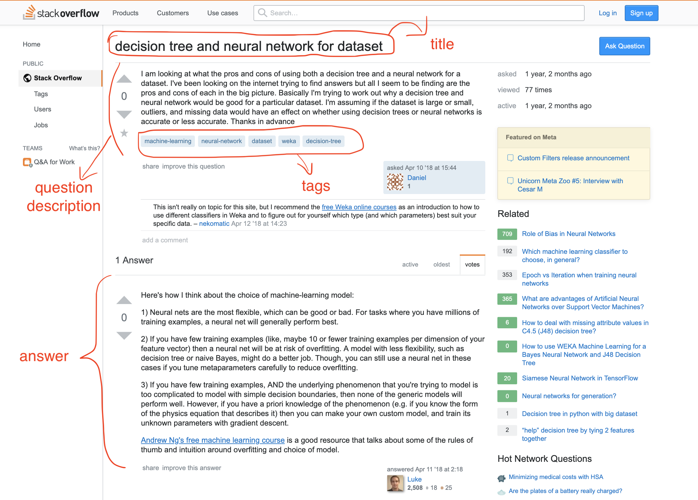
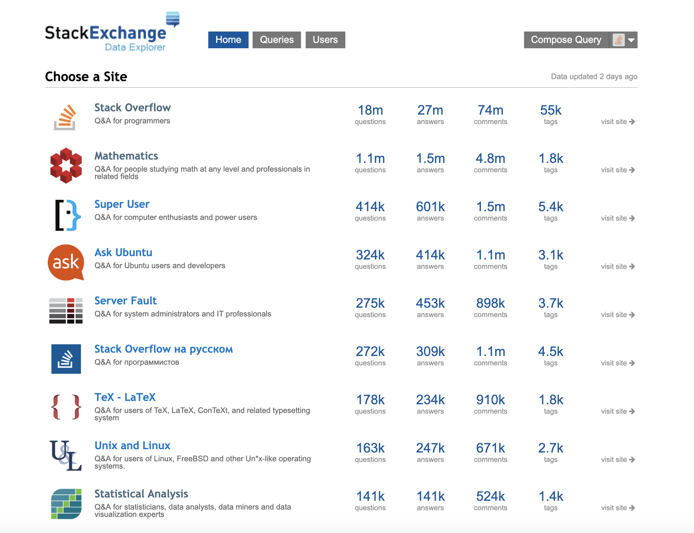

## Report 01 - Motivation and Focus

### Motivation

The initial motivation for this project has nothing to do with stackexchange but with scientific papers.

Currently (July 2019), we have ACL papers dataset along with annotated data (method, dataset, NER and so on). We want to develop a QA system for these papers. For instance, given a question, the system can find a portion of text that answers the question.

In a sense, this looks like **information retrieval** of finding the relevant paragraph to the question.

However, we thought that using regular **IR system** like TF-IDF might not perform well because the answer carries not only a few overlapping phrases to the question and a whole lot more information that is noise to the system.

**For example:**

Question: How to evaluate a model?Relevant sentence:To evaluate the performance of our proposed dataset and model, we compare it with the following baselinesTo evaluate the performance of our model, we collect a large amount of document-summary pairs associated with several reader comments from social media website.

Though the second sentence above may be related with the given question, however, that sentence is from introductory paragraph which does not give much detail to the reader.

The **initial idea** was to:

1. For each paragraph, generate a question.
2. Given a query, compare the query with the generated question and return the corresponding paragraph.

### StackExchange
Link: https://data.stackexchange.com/

Obviously, our ACL dataset does not contain any question corresponding to each section or paragraph. We look around and stumble upon **stackexchange**, a website where people asks questions to the community hoping to find answers to their coding, statitics, or other tech-related problem.

What we are interested in are only **title**, **tags** and **answer**.

One of its sub-websites, https://ai.stackexchange.com/, has good discussons on AI topic or other machine-learning related proble. Unfortunately, the size of the corpus is very small (4K of questions and 5.3K of answers, at the time of writing).

There is also https://stats.stackexchange.com/ which most of questions are related to statistics. The corpus is fairly big but it seems most tags are not AI or CS related. That is why we did not select this dataset as our fcous.

Instead of using ai.stackexchange.com, we use **stackoverflow.com**. The downside to this is stackoverflow website contains too much information (18M questions and 27M answers) and many of them are about coding. This is not exactly what we want since our initial idea was to work with scientific paper.As a result, we extracted top tags in ai.stackexchange.com. Manually, match those tags with tags in stackoverflow website.**Note**: The tags used in ai.stackexchange.com are not the same as ones in stackoverflow.

**For example:**

- "neural-network" in one site

- "neural-network**s**" in another

With these tags, we are ready to extract relevants post from stackoverflow.