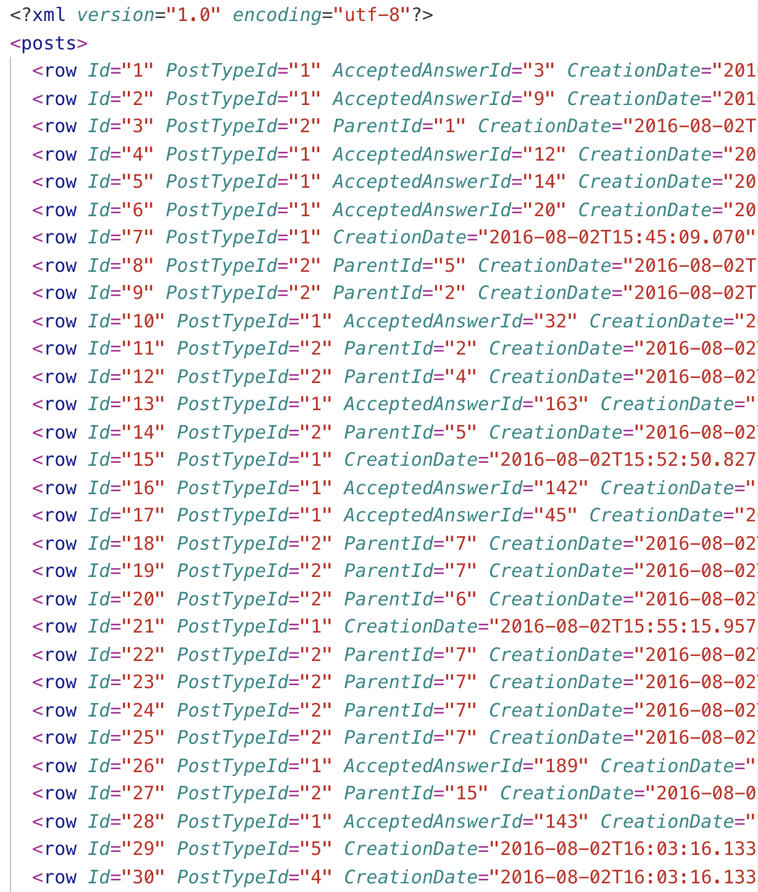
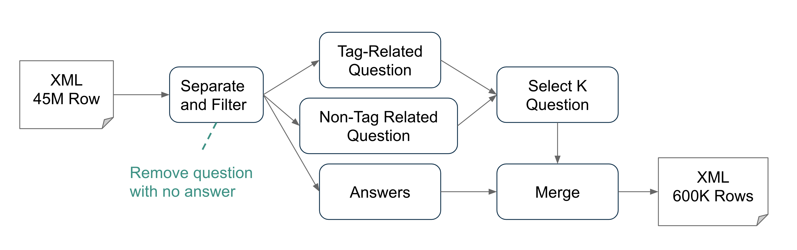
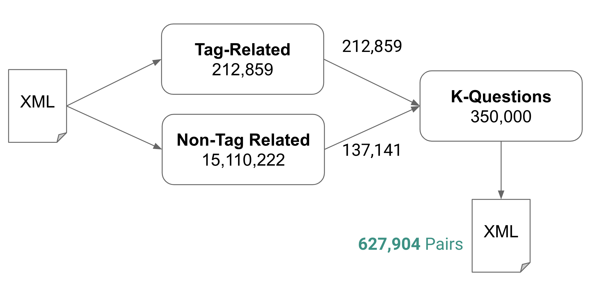

## Report 02 - StackOverFlow

### Data Extraction

Previously, we have extracted top tags in ai.stackexchange.com and used it to hand-pick the same (or similar) tag in stackoverflow.

Dataset retrieved from: https://archive.org/details/stackexchange

Published at: June 03, 2019

**Tags**: "neural-network", "conv-neural-network", "recurrent-neural-network", "convolutional-neural-network", "biological-neural-network", "neural-network-tuning", "machine-learning", "machine-learning-model", "deep-learning", "reinforcement-learning", "natural-language-processing", "nlp", "stanford-nlp", "natural-language-process", "image-recognition", "genetic-algorithm", "evolutionary-algorithm", "classification", "game-ai", "text-classification", "computer-vision", "q-learning", "dataset", "backpropagation", "lstm", "object-recognition", "gradient-descent", "unsupervised-learning", "chatbot", "prediction", "monte-carlo-tree-search", "monte-carlo", "artificial-intelligence", "data-science", "robotics", "linear-regression", "non-linear-regression", "generative-adversarial-network", "game-theory", "pattern-recognition", "activation-function", "statistics", "probability", "probability-density", "probability-theory", "word-embedding", "voice-recognition", "bioinformatics", "word2vec", "supervised-learning", "computational-linguistics", "sentiment-analysis", "linear-algebra", "combinatorics", "regression", "logistic-regression", "time-series", "hypothesis-test", "bayesian-networks", "hierarchical-clustering", "clustering", "random-forest", "data-mining", "bigdata", "algorithm", "graph-algorithm", "sorting-algorithm", "algorithm-design", "tensorflow", "keras"

**Property of XML Dataset**: Here is the XML for the dataset. Each row is a post. 

1. **PostTypeId=1**: Question with title and tags.
2. **PostTypeId=2**: Answer to a question (denoted by ParentId, the question it answers)

###Extractive Procedure

Below is the figure for selecting relevants (Q, A) pairs from stackoverflow dataset.

1. Separate between questions and answers
2. Ignore question that has no answer
3. Group questions into (i) tag-related questions (ii) all-other questions
4. We don't want to select all questions. Instead we pick only K questions. 
   1. Choose all tag-related questions
   2. If that does not fulfill K questions yet, select randomly from non-tag related questions sets until we have K questions.
5. Each question has one or more answers. Merge each answer to its corresponding question to produce a new row. Save them into an XML file
6. Shuffle the **627,904** rows dataset and split into 3 portions following (90-5-5 rules) to produce train, dev and test sets. We then have, **565,114** for training set, **31,395** for dev set, and **31,395** for test set.

### Data Cleaning

### Data Characteristics

### Project Folder

