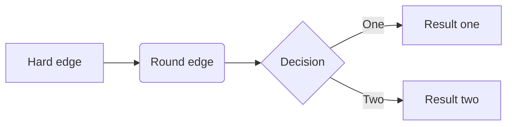

## Report 02 - StackOverFlow

### Data Extraction

```mermaid
graph LR
A[Hard edge] -->B(Round edge)
    B --> C{Decision}
    C -->|One| D[Result one]
    C -->|Two| E[Result two]
```

### Data Cleaning

### Data Characteristics

### Project Folder

